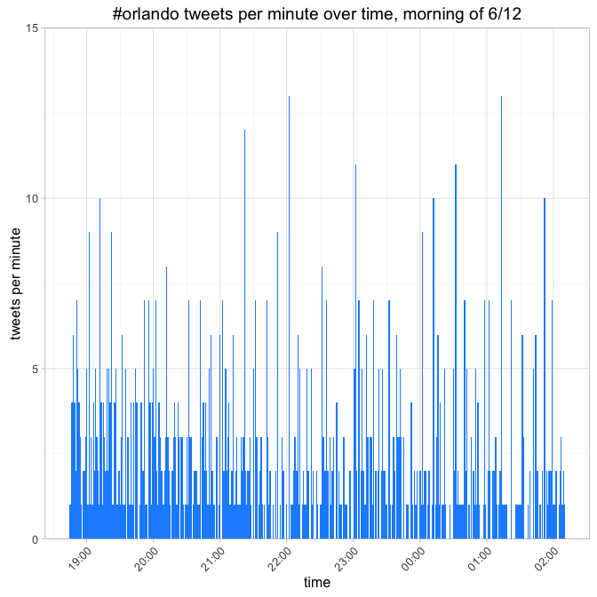

# orlando
Joe Willage  
June 16, 2016  

I want to begin by saying that what happened in Orlando is a tragedy. Any shooting is simultaneously devastating and angering, but one targeted at a specific community seems to add an extra layer of disgust. I also spent 24 years of my life in Florida, a majority of my family and friends are there. Thankfully, no one I know personally was hurt, but I have friends who lost people they cared about.  

It was with a heavy heart that I put this work together. The tweets here are more than just data points. It's not people talking about sports or cat videos. It's the unfolding of a tragedy, wherein an enormous amount of lives were lost. This analysis is an attempt to understand how news of the shooting spread on Twitter.  

By understanding how national headlines like this spread across the internet, we gain a better understanding of how to to disseminate news in an emergency. The fact that Pulse *tweeted* during the attack for everyone to run from the club, is telling.  

The analysis explores the use of the #orlando hashtag in the moments before and hours after the attack.  


```r
library(knitr)
opts_chunk$set(echo = TRUE, cache = TRUE, cache.path = "cache/", 
               fig.path = "figure/", fig.width = 7, fig.height = 7)
```


```r
library(twitteR)
library(lubridate)       
```

```
## 
## Attaching package: 'lubridate'
```

```
## The following object is masked from 'package:base':
## 
##     date
```

```r
library(ggplot2)
library(scales)
```


```r
setup_twitter_oauth(readline("consumer.key"),
                    readline("consumer.secret"),
                    readline("access.token"),
                    readline("access.secret"))
# tweets prior 6/12 2:09, when attack began
o.prior <- searchTwitter("#orlando", n=1000, maxID = "741875325752233985")
```


###Prior to the attack###


```r
created.prior <- as.POSIXct(sapply(o.prior, function(x) x$created), origin = "1970-01-01")
df.prior <- data.frame(created.prior)
ggplot(data = df.prior, aes(created.prior, ..count..)) + 
  geom_histogram(binwidth = 60 * 60, fill = "dodgerblue", color = "black") +
  theme_light() +
  theme(
    axis.text.x=element_text(angle=45, hjust=1, vjust=1)
  ) +
  scale_y_continuous(limits = c(0, 155), expand= c(0, 0)) + 
  labs(x = "time", y = "tweets per hour", 
       title = "#orlando tweets per hour over time, morning of 6/12")
```


```r
ggplot(data = df.prior, aes(created.prior, ..count..)) + 
  geom_histogram(binwidth = 60, fill = "dodgerblue") +
  theme_light() +
  theme(
    axis.text.x=element_text(angle=45, hjust=1, vjust=1)
  ) + 
  scale_y_continuous(limits = c(0, 15), expand= c(0, 0)) + 
  labs(x = "time", y = "tweets per minute", 
       title = "#orlando tweets per minute over time, morning of 6/12")
```



Between 10pm - 2am, tweets with '#orlando' were coming in at a rate of 
127 tweets per hour, and 
2.9 tweets per minute (tpm). 

###During and after the attack###


```r
# tweets post 6/12 2:09
o.post <- searchTwitter("#orlando", n=1000, maxID = "741897285752233985")
```


```r
created.post <- as.POSIXct(sapply(o.post, function(x) x$created), origin = "1970-01-01")
hour(created.post) <- hour(created.post) - 4
df.post <- data.frame(created.post)
ggplot(data = df.post, aes(created.post, ..count..)) + 
  geom_histogram(binwidth = 60, fill = "dodgerblue") +
  theme_light() + 
  theme(
    axis.text.x=element_text(angle=45, hjust=1, vjust=1)
  ) +
  scale_y_continuous(limits = c(0, 55), expand= c(0, 0)) + 
  scale_x_datetime(breaks = date_breaks("10 min"), labels = date_format("%H:%M")) +
  labs(x = "time", y = "tweets per minute", 
       title = "#orlando tweets per minute over time, morning of 6/12")
```


The 1,000 tweets *prior* to the attack occurred in a span of 7.4 hours, whereas *post*-attack, 1,000 tweets racked up in 1.4 hours. 

To measure the rate of growth, we'll compare the ratio of tpm from one minute to the next. 
Let's see all the minutes with an increase of at least 50% tweets per minute.  


```r
times <- table(paste0((hour(created.post) + 4) %% 24, ":", 
                      formatC(minute(created.post), width = 2, flag = "0")))
times <- data.frame(times)
times$increase <- c(NA, times[2:nrow(times), "Freq"] / times[1:nrow(times)-1, "Freq"])
times <- times[complete.cases(times), ]
names(times)[1:2] <- c("time", "tweets")
print(times[times$increase >= 1.5, ], row.names = F)
```

```
##  time tweets increase
##  2:18      2 2.000000
##  2:22      2 2.000000
##  2:32      3 3.000000
##  2:45      4 4.000000
##  2:49      2 2.000000
##  2:52      3 3.000000
##  2:59      3 3.000000
##  3:01      6 2.000000
##  3:05      5 1.666667
##  3:06     11 2.200000
##  3:13     49 1.884615
##  3:16     28 1.647059
##  3:22     30 2.500000
##  3:23     45 1.500000
##  3:26     44 1.517241
```

We'll focus on the rows at 3:06 am and beyond, where the number of #orlando tweets is greater than 5. Now let's try to zero in on these large jumps in tweets per minute, and determine how they happened. The process will be looking at the tweets created in the minute of interest as well as the minute prior, and examine which ones had high numbers of favorites or retweets. The idea is to pinpoint which new tweets are catching wind.  

For instance, the first large jump in tpm was between 3:05 - 3:06, where there went from 5 tweets mentioning #orlando to 11. We'll examine the tweets in that two minute span.  


```r
influencers <- data.frame()
for (i in 1:length(o.post)) {  
  ct <- as.POSIXct(o.post[[i]]$created, origin = "1970-01-01")
  # searching for tweets created at 3:05 or 3:06, adjust tz from UTC to ET by subtracting 4
  if (hour(ct) - 4 == 3 & (minute(ct) == 5 | minute(ct) == 6)) {
    influencers <- rbind(influencers, cbind(o.post[[i]]$screenName, o.post[[i]]$id,
                                            o.post[[i]]$retweetCount, o.post[[i]]$favoriteCount))
  }
}
names(influencers) <- c("screenname", "twetId", "rt", "fav")
```


```r
# enrich screennames with follower count
users <- lookupUsers(influencers$screenname)
```


```r
influencers$followersCount <- NULL
for (i in 1:nrow(influencers)) {
  influencers[i, "followers"] <- users[[i]]$followersCount
}
influencers
```

```
##         screenname             twetId   rt fav followers
## 1        peteb1974 741889518798700544    7   0       315
## 2      laurenmist1 741889432366817280 2774   0        71
## 3          muzeart 741889432085757952  442   0       563
## 4   JAWBreakerDBNJ 741889396669087744 1516   0       519
## 5  TearInMyLaneBoy 741889385382154240  442   0      1182
## 6            m1cvv 741889381435379716   68   0      8273
## 7       GayPatriot 741889351026651136   68   0     53547
## 8   DakotaThurowTV 741889340394065920 1516   0        64
## 9    FlawlessDiana 741889339454455813   68   0       379
## 10        CakeJobs 741889328100429824    0   0       221
## 11          taskrm 741889284223946752   68   0       399
## 12    Stewartmoore 741889268390461440 1516 491      6643
## 13      pescobaro_ 741889185657675776  442   0      1095
## 14   bitterchickey 741889179030716417    1   0       271
## 15        Caseb901 741889103034253312  442   0       198
## 16         OURshow 741889060977967104    0   0      3722
```

Now we have a list of the #orlando tweets from 3:05 - 3:06. The big one here is clearly @GayPatriot. While their tweet may have only received 68 RTs, they have over 53K followers. And the tweet turns out to be a retweet by Stewart Moore, a reporter with WESH Orlando. 

The next highest follower count belongs to @m1cvv, Micky Welch, who has 8,200 followers. That handle *is* actually a news correspondent. However, the tweet again turns out to be a RT from Stewart Moore. As an aside, Welch's first tweet on the attack was an original tweet linking to Moore's Facebook at 2:40 am, but it did not use the #orlando hashtag. Welch continued tweeting about the tragedy until around 4:40 am.  

The third most followed user on the list is Moore himself, @Stewartmoore. Moore live-tweeted coverage **all day**, from 2:40 am to 10:29 pm, including a 9:22 am tweet to @orlandohealth hospitals offering blood. 

So that's the perspective from users with the most followers, who we often consider influencers. Another metric we typically look at with social, is the number of interactions: which tweets are the most favorited and retweeted? The top tweet in the group, with 2,774 RTs was about the shooting of Christina Grimmie the day prior. Then we have three tweets with exactly 1,516 RTs. It seems odd that all three tweets have the same number of RTs. As it turns out, that RT number is how many retweets *currently* exist. And it so happens that all 3 of those tweets are Stewart Moore retweets (well, 2 RTs + the original). Any way you slice it, Moore was the one responsible for spreading the initial word, with respect to the #orlando hashtag. 

Focusing back on tweets per minute, the next major increase for #orlando happened 7 minutes later, at 3:13. We'll reapply the above process and check out all the users that tweet about #orlando between 3:12 - 3:13.


```r
influencers.313 <- data.frame()
for (i in 1:length(o.post)) {  
  ct <- as.POSIXct(o.post[[i]]$created, origin = "1970-01-01")
  if (hour(ct)-4 == 3 & (minute(ct) == 12 | minute(ct) == 13)) {
    influencers.313 <- rbind(influencers.313, cbind(o.post[[i]]$screenName, o.post[[i]]$id,
                                            o.post[[i]]$retweetCount, o.post[[i]]$favoriteCount))
  }
}
names(influencers.313) <- c("screenname", "twetId", "rt", "fav")
```


```r
users.313 <- lookupUsers(as.character(influencers.313$screenname))
```


```r
users.313.df <- NULL
for (i in 1:length(users.313)) {
  users.313.df <- rbind(users.313.df, cbind(users.313[[i]]$screenName, 
                                            users.313[[i]]$followersCount))
}
users.313.df <- as.data.frame(users.313.df, stringsAsFactors = F)
names(users.313.df) <- c("screenname", "followersCount")
users.313.df$followersCount <- as.numeric(users.313.df$followersCount)

influencers.313 <- merge(influencers.313, users.313.df)
tail(influencers.313[order(influencers.313$followersCount), ], 10)
```

```
##       screenname             twetId   rt fav followersCount
## 58 SocialCapitol 741891093739020289 1516   0           5766
## 23      INFOS_EN 741890884019597312   68   0           5784
## 24      INFOS_EN 741890808870277120  188   0           5784
## 51 radicalchriss 741891095311814656 1516   0           5996
## 67  SWDC4Hillary 741891111153721344 1516   0           7100
## 68   thebadboosh 741890779182956544 1516   0           9722
## 1   __SallyForth 741891105952813056 1516   0          10575
## 54 SallyAlbright 741891092178710528 1516   0          14326
## 74      wtfelias 741890936515371008  442   0          15145
## 2     _MoonWinx_ 741891095743844352 1516   0          27073
```

Above are the top 10 most followed handles in the group. All those tweets with 1,516 RTs are people retweeting Moore. The other common tweets seen throughout the full 3:12 - 3:13 list have 442 and 188 retweets. Those respectively belong to a CBS freelancer, Joanna Bouras, and Stewart Moore. 

All of the analysis so far was on the 1,000 #orlando tweets following 2:09 am, a span of 1.4 hours. Now we expand to look at the 10,000 tweets mentioning #orlando after 3/12 2:09 am. 


```r
tweets <- searchTwitter("#orlando", n=10000, maxID = "741925325752233985", 
                        sinceID = "741875325752233985")
```


```r
created <- as.POSIXct(sapply(tweets, function(x) x$created), origin = "1970-01-01")
df <- data.frame(created)
hour(df$created) <- hour(df$created) - 4
df$highlight <- FALSE
df[7700:9009, "highlight"] <- TRUE
ggplot(data = df, aes(created, ..count..)) + 
  geom_histogram(binwidth = 60, aes(fill = highlight)) +
  theme_light() + 
  theme(
    axis.text.x = element_text(angle=45, hjust=1, vjust=1),
    legend.position = "none"
  ) +
  scale_y_continuous(limits = c(0, 125), expand= c(0, 0)) + 
  scale_x_datetime(breaks = date_breaks("10 min"), labels = date_format("%H:%M")) +
  scale_fill_manual(values = c("grey", "dodgerblue")) +
  labs(x = "time", y = "tweets per minute", 
       title = "#orlando tweets per minute over time, morning of 6/12")
```


10,000 #orlando tweets after 2:09 am are logged in a span of 3.2 hours. Now we have a period up to 5:25. Most of the tpm increase appears to happen between 3:35 and 3:55, as highlighted in the graph. Again, we use the rate of tpm compared to the previous minute. 


```r
times <- table(paste0(hour(created), ":", formatC(minute(created), width = 2, flag = "0")))
times <- data.frame(times)
times$increase <- c(NA, times[2:nrow(times), "Freq"] / times[1:nrow(times)-1, "Freq"])
times <- times[complete.cases(times), ]
names(times)[1:2] <- c("time", "tweets")
times[60:85, ]
```

```
##    time tweets  increase
## 61 3:35     27 0.7941176
## 62 3:36     34 1.2592593
## 63 3:37     39 1.1470588
## 64 3:38     36 0.9230769
## 65 3:39     46 1.2777778
## 66 3:40     47 1.0217391
## 67 3:41     46 0.9787234
## 68 3:42     60 1.3043478
## 69 3:43     64 1.0666667
## 70 3:44     42 0.6562500
## 71 3:45     64 1.5238095
## 72 3:46     56 0.8750000
## 73 3:47     67 1.1964286
## 74 3:48     58 0.8656716
## 75 3:49     81 1.3965517
## 76 3:50     71 0.8765432
## 77 3:51     90 1.2676056
## 78 3:52     86 0.9555556
## 79 3:53    105 1.2209302
## 80 3:54     93 0.8857143
## 81 3:55    100 1.0752688
## 82 3:56     84 0.8400000
## 83 3:57     71 0.8452381
## 84 3:58     95 1.3380282
## 85 3:59     98 1.0315789
## 86 4:00     81 0.8265306
```

The only time in the steep curve (and through the rest of the data) when the rate increases by at least 50% is at 3:45, with an increase from 42 to 64 tpm. We still see increases at a less steep rate through 3:55, where it plateaus at about 84 tpm. Exploring that jump at 3:45 we see the following...


```r
influencers.345 <- NULL
for (i in 1:length(tweets)) {  
  ct <- as.POSIXct(tweets[[i]]$created, origin = "1970-01-01")
  if (hour(ct) - 4 == 3 & (minute(ct) == 44 | minute(ct) == 45)) {
    influencers.345 <- rbind(influencers.345, cbind(tweets[[i]]$screenName, 
                                                    tweets[[i]]$id,
                                                    tweets[[i]]$retweetCount,
                                                    tweets[[i]]$favoriteCount))
  }
}
influencers.345 <- as.data.frame(influencers.345, stringsAsFactors = F)
names(influencers.345) <- c("screenname", "twetId", "rt", "fav")
influencers.345$rt <- as.numeric(influencers.345$rt)
```


```r
users.345 <- lookupUsers(as.character(influencers.345$screenname))
```


```r
users.345.df <- NULL
for (i in 1:length(users.345)) {
  users.345.df <- rbind(users.345.df, cbind(users.345[[i]]$screenName, 
                                            users.345[[i]]$followersCount))
}
users.345.df <- as.data.frame(users.345.df, stringsAsFactors = F)
names(users.345.df) <- c("screenname", "followersCount")
users.345.df$followersCount <- as.numeric(users.345.df$followersCount)

influencers.345 <- merge(influencers.345, users.345.df)
tail(influencers.345[order(influencers.345$followersCount), ], 10)
```

```
##          screenname             twetId   rt fav followersCount
## 51     JoanneCangal 741899213135437825   10   0           2575
## 95     TacoBellGawd 741899005798518784  442   0           2587
## 104      whoreguiez 741899240876580864  442   0           2906
## 86  RealShowstopper 741899079312146433 1516   0           3157
## 63        mangokyun 741899060978683904 1516   0           3733
## 36       fuegopazzo 741899271792889857    1   0           3915
## 21     celestialwes 741898864630718465  199   0           5605
## 41    hannespurpose 741898886235754497   10   0           7917
## 96   TerreurMonitor 741898865390059520   39   0          15712
## 91     SkyNewsBreak 741899212112166912  139  42        2146033
```

Again there is a list of tweeters largely dominated by Moore retweets (the rows with 1516 or 442 as the rt value). The one exception here is @SkyNewsBreak, run by Sky News in London. @SkyNewsBreak has over 2 million followers, and their post at 3:45 received 139 RTs to date. It's clear that Sky News' tweet had immediate impact: their tweet accounts for 7 of the 106 #orlando tweets between 3:44 - 3:45 (6 RTs + the 1 original) . It's worth mentioning that the time in London was 8:45 am, and Sky News had the opportunity to reach many more followers than US authors. 

The final tpm jump we'll explore is the jump from 3:48 - 3:49, which had a 39% tpm increase. 


```r
influencers.349 <- NULL
for (i in 1:length(tweets)) {  
  ct <- as.POSIXct(tweets[[i]]$created, origin = "1970-01-01")
  if (hour(ct)-4 == 3 & (minute(ct) == 48 | minute(ct) == 49)) {
    influencers.349 <- rbind(influencers.349, cbind(tweets[[i]]$screenName, 
                                                    tweets[[i]]$id,
                                                    tweets[[i]]$retweetCount,
                                                    tweets[[i]]$favoriteCount))
  }
}
influencers.349 <- as.data.frame(influencers.349, stringsAsFactors = F)
names(influencers.349) <- c("screenname", "twetId", "rt", "fav")
influencers.349$rt <- as.numeric(influencers.349$rt)
```


```r
users.349 <- lookupUsers(as.character(influencers.349$screenname))
```


```r
users.349.df <- NULL
for (i in 1:length(users.313)) {
  users.349.df <- rbind(users.349.df, cbind(users.349[[i]]$screenName, 
                                            users.349[[i]]$followersCount))
}
users.349.df <- as.data.frame(users.349.df, stringsAsFactors = F)
names(users.349.df) <- c("screenname", "followersCount")
users.349.df$followersCount <- as.numeric(users.349.df$followersCount)

influencers.349 <- merge(influencers.349, users.349.df)
tail(influencers.349[order(influencers.349$followersCount), ], 10)
```

```
##         screenname             twetId   rt fav followersCount
## 16       ConlinLaw 741900312143892480  188   0           5412
## 68      tsnmifeels 741900198952198144 7330   0           6125
## 41 loserboymichael 741900293101719553  199   0           9018
## 22       elielcruz 741900249862639617  148 270           9798
## 56   radiondadurto 741900175396986880    9   0          15098
## 45         MAGS_SP 741900251003379712    0   1          26500
## 74            WESH 741900135337185280 1516   0         108850
## 75            WESH 741900150822572032  188   0         108850
## 76            WESH 741900134095704065   68   0         108850
## 50    Nettaaaaaaaa 741900221228060672 1516   0         133656
```

We still see a lot of the Moore 1516 RTs on this list. The user with the most followers here is @Nettaaaaaaaa, civil rights activist Johnetta Elzie, with over 133K followers. Then there are 3  tweets by @WESH, who has 109K followers. WESH is the Orlando news station that Moore reports for. Unsurprisingly, we see 3 Moore retweets.  

The work here only looked at tweets containing the #orlando hashtag. News outlets like CNN and WSJ tweeted the event without hashtagging it. It's possible that may paint a different picture, but this is the one of #orlando.  

When I started this work, I wasn't sure what I would find. I imagined there would be a big breaking tweet by the Orlando Sentinel or some news organization. It turns out, I found the story of a local hero, working around the clock to not just spread the news, but also spread humanitarianism in a time of need. And that's what it's all about.  
